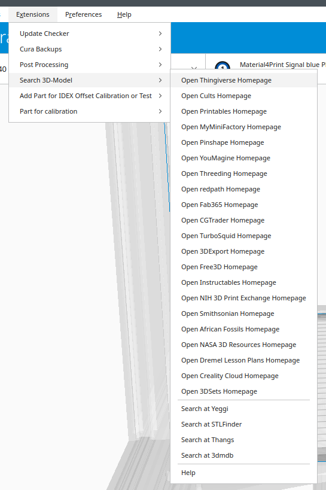

# 3D-Models Plugin for Ultimaker Cura

This plugin adds a menu with links to the best 3D-Model Repositorys and Marketplaces 

## Install
In the plugin directory, create a subdirectory called **Models**. In this subdirectory create another subdirectory with the same name. Unpack the contents of the zip-file in this subdirectory and restart Cura.

## Dependency
A browser must be installed on the operating system and an Internet connection must be available

## Language
The plugin was translated to German. For further translations into your mother tongue I need your help. It's easy. In the i18n directory, open the models.pot file with an editor and put the translation between the quotes from msgstr and email it to me. You can find my email address in the models.pot file.

